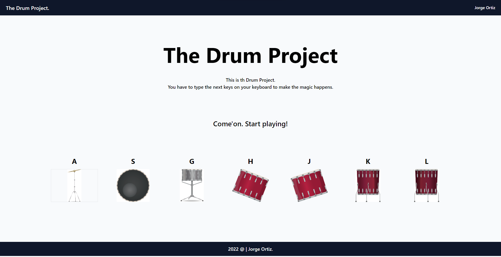

# 01. Drum Project.

This is the Drum Project, where you can type on any of the keys in your keyboard and it'll produce a sound.
Come on, try it and have fun.

This project will only allow you to type these keys:

* A.
* S.
* A.
* G.
* H.
* J.
* L.

## Images.

This is an image about this project.

## Softwares and programming languages.

* VS Code.
* Javascript.
* Tailwind CSS.
* HTML, CSS.

## Author.

* Jorge Ortiz.
* ortiz.mata.jorge@gmail.com
* Software engineer.
